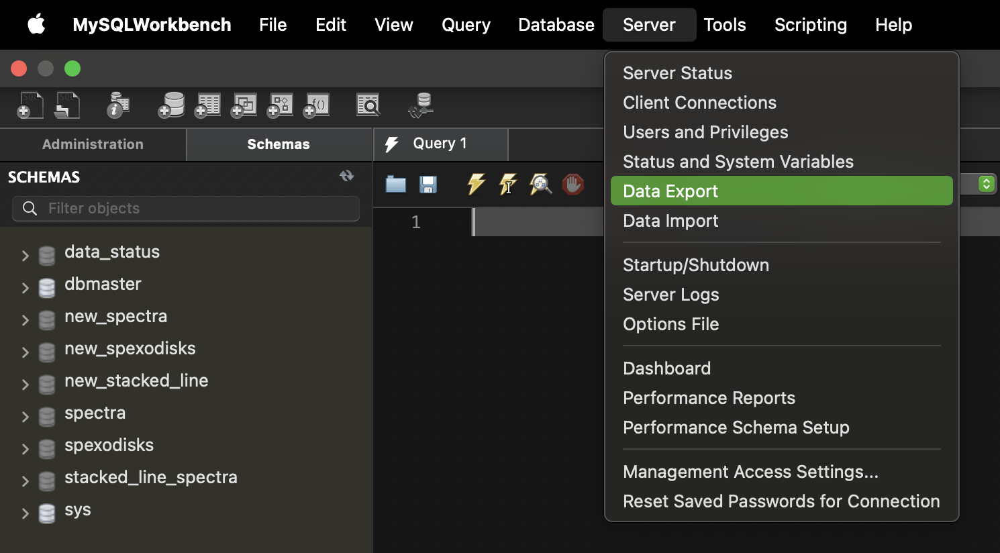
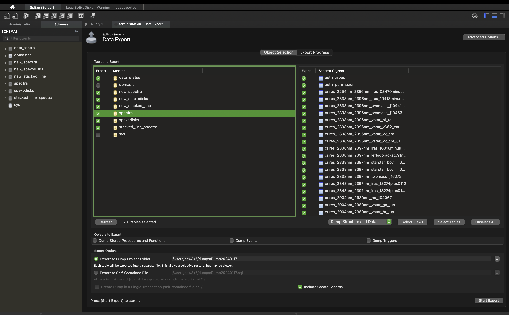

# Portal
This is a monolithic repository 
that links the work of the SpExoDisks development teams.
It now includes the files needed to run the 
1. Python Backend 
2. NGINX file/web server
3. MySQL database

You will need to install the frontend and input data repositories
to have a fully functional development environment.

## Initial Setup

### Install Docker

[Docker](https://docs.docker.com), which is required to run the 
SpExoDisks data processing pipeline and website. 
Docker will manage the various environments 
and automatically get new versions of 
Python, NGINX, Node base images as well as the changes made to 
the code base for the SpExoDisks website.
It is recommended to have a fast internet connection and a lot of storage space. 
Periodically, you may find it helpful to run 

```bash
docker system prune --all --force
```

to remove all old images, containers, caches, etc. (everything that is 
not currently running). I find that I have enough hard disk space, 
but that my back-up storage drives get full much faster.

## Initial Setup

*Here is what you need before you start:*
- A unix terminal (Git-Bash on Windows works, or use PowerShell)
- sudo privileges (Administrator privileges on Windows)
- Git installed https://git-scm.com/downloads
- a GitHub.com account https://github.com
  - Obtain a personal access token: https://docs.github.com/en/authentication/keeping-your-account-and-data-secure/creating-a-personal-access-token
    Save this in a save place to cut and paste from later.
  - Send your GitHub username to the SpExoDisks Technical Administrators
- Docker installation https://docs.docker.com/engine/install/
- Unix step: docker compose installation (docker compose comes with
Windows and Mac Installation) https://docs.docker.com/compose/install/.
- Test the docker is running with `docker version` You should see both a `client` and `Engine`.
- Get the connection credentials for the SpExoDisks MySQL server.
  - It is easy to generate these files, ask SpExoDisks Technical Administrators for access.

## Cloning and Running Portal
With your command line environment setup, and the correct privileges
to clone the various GitHub repositories and/or docker images, the process
is meant to be streamed lined with a script, Portal/shell/init.sh.


Depending on how you use your computer or if you are on an unix server,
you may have to enter your GitHub.com `username` and paste your 
`personal access token`.

### Portal (this public repository)

```
git clone https://github.com/spexod/Portal
```

and then enter the base repository with 

```bash
cd Portal
``` 
for the following commands.

### Additional repositories

These may require permissions as they are private repositories.
But these can be installed with:

```
./shell/init.sh
```

## required files for development
### Server ssh key `spexo-ssh-key.pem`

> [!WARNING]
> SSH is required for this example.
> Windows users will need to use [putty](https://www.putty.org/) or another SSH client.
> Please see documentation for your SSH client for how to use the key.

The private key for the AWS server. 
This is required to access the server computer,
an AWS virtual machine.

This is a file that is must be issued from the SpExoDisks Technical Administrators.
It is not stored in the repository, but is stored in the `~/.ssh/keys/` directory.
You can create this directory with the following command:

```bash
mkdir -p ~/.ssh/keys
```

Now we can make a an ssh config file that will allow 
us to connect to the server with the following command:

```bash 
touch ~/.ssh/config
```

Open the file with your favorite text editor and add the following lines:

```text
Host spexo
    User ubuntu
    Hostname spexodisks.com
    IdentityFile ~/.ssh/keys/spexo-ssh-key.pem
```

### The `.env` file
The `.env` file is used to store environment variables for the Docker Compose,
but is also imported by Python tools outside of Docker by importing the
variables with the python-dotenv package.

An `.env` file is required in the root directory of the Portal repository.
See the `.env.example` file for examples of the required fields.

SpExoDisks developers will need to provide credentials for new users 
connect to the MySQL server at spexodisks.com.

Local database development is also possible. 
The **first time** you run the Docker commands,
this MySQL database is **initialized** with the usernames and passwords in the `.env` file,
that are then used for all future connections. For example:

```
COMPOSE_PROFILES=db,api,frontend
MYSQL_USER="your-username-for-mysql"
MYSQL_PASSWORD="your-password-for-mysql"
## Host for inside the docker network
MYSQL_HOST="mysqlDB"
```

### `.env` variable: DATA_NEW_UPLOADS_ONLY

This variable is used to control the data upload process. 
When set to `true`, the data upload process will 
only upload new spectra and files to the MySQL server.

`true` is the default value for this variable, set in compose.yaml,
that is when the variable is not set in the `.env` file.

When set to `false`, the data upload process will re-upload all spectra and files.
This could be a useful to update all spectra after formatting changes,
such as to the changes to FITS files.


## .evn File Configurations

The `.env` will provided to you by the SpExoDisks administrators,
if contains a number authentication credentials and other fields
that need to be kept secret.

### Pipeline for Public Website

For configuration, 
local docker containers connect to the MySQL server at spexodisks.com.
This MySQL Server is used public website and for this pipeline.

**Example `.env` file for pipline processing:**
```
# Configuration
COMPOSE_PROFILES=api,web
MYSQL_HOST="spexodisks.com"
DATA_NEW_UPLOADS_ONLY=true
# Authentication
MYSQL_USER="?YourUsername"
MYSQL_PASSWORD="?AReallyLongPassword"
DJANGO_EMAIL_USER="?not.very.secret.email.address@gmail.com"
DJANGO_EMAIL_APP_PASSWORD="?super-sectet-passoword"
```

### Development using a Local MySQL Server

> [!TIP]
> `./mysql/reset.sh` is a hard reset for the local MySQL service.
> If the MySQL container is started, 
> it creates files that are viewable at `./mysql/local/`.
> Use (or see this script) if you want to start fresh 
> by deleting the persistent database files or resetting the username and password.

**Example `.env` file for local development:**

```text
COMPOSE_PROFILES=db,api
MYSQL_USER="root"
MYSQL_PASSWORD="do-not-use-keyboard-walking-passwords"
```

## Recommended Scripts for Local Database Development

Create MySQL tables and FITs files for the SpExoDisks website with:

```
./data.sh
```

Build and display the frontend website locally with:

```
./display.sh
```


## Starting the MySQL Server

Local development can be done with a MySQL server running in a Docker container.

> [!WARNING]
> This MySQL server is required at build-time for "backend" Docker images.
> Local development users have two options to keep in mind. 
> Consider these options to start the MySQL server in the background
> before calling the primary shell scripts used build the Docker images
> (`./data.sh`, `./display.sh`, `deploy.sh`, `deploy_update.sh`).
> 
### Option 1: Start the MySQL Server with Docker Compose

```
docker compose up mysqlDB --detach
```

This starts the MySQL server in the background. 
The server can be stopped with: `docker compose down`.

### Option 2: Start the MySQL Server with the backend Docker Image

This required uncommenting three lines in the compose.yaml 
in the "backend" service, using the `depends_on` directive.

```
    # Optionally uncomment the following lines when using the "db" profile.
    # Wait for the database to be ready before starting the backend.
#    depends_on:
#      mysqlDB:
#        condition: service_healthy
```

> [!WARNING]
> Do not commit uncommented line to the repository,
> as causes the mysqlDB container to start in all situations
> and not only when the "db" profile is used.
> The production database pipeline does not use the "db" profile.


## Scripts

All the scripts discussed in the section
stop several times and wait for the user to press
any-key to continue. The stops happen at critical steps to allow users to read
any error message before continuing to subsequent steps. Use _`control-c`_ in the 
terminal to stop a script at any time for any reason.

Running the scripts can be a little different each operating system. 
For each system type, see the examples below for running the `data.sh` script.

__Linux__

`sudo ./data.sh`

__Mac__

sudo is not allowed for docker commands, so we use:
`./data.sh`

__Windows (GitBash)__

`./data.sh`

__Windows (PowerShell)__

`.\data.sh`


### Data upload `data.sh`
`data.sh` is a script that will start from input data files and create 
the MySQL tables and FITS/TXT files for the SpExoDisks website.

```bash
./data.sh
```

### Testing `display.sh`

This does not affect the live website, but it does use a shared resource
(the MySQL server) to test the data upload. Make sure to communicate with
your team members so that one person is only doing this at a time  
(Consider setting up a local SQL sever on your computer and setting the 
sql_config.py to point to that server if you find there are often conflicts).

To test the initialization or any updates, we can make a full version of the
test website using `display.sh` (make sure the docker damon is running!)
This script takes a long time on for two reasons:
1. Run the scripts `data.sh` to upload the data to the MySQL server. 
   Repeat these steps if you are testing a new data upload or need 
   make corrections to a previous data upload.
2. `display.sh` builds the docker images from freshly downloaded repositories with no cache,
   later builds will use cached data.

```bash
./display.sh
```

Following the prompts in the script, once the images are built and then launched
into containers, see the test website on your local machine by navigating your
browser to <http://localhost>.

Once you are done testing the website in the browser, use `control-c` to
stop the containers.

### Build Deployable containers `deploy.sh`

The server requires a configuration that is not compatible with local testing.
Building docker images to be used and pulled by the server uses a special 
script, `deploy.sh`.

```bash
./deploy.sh
```

> [!NOTE]
> This script requires the server requirements requires access to the server.
> See the section [Server ssh key](#server-ssh-key-spexo-ssh-keypem) for more information.

`deploy.sh` is meant to be run directly after a successfully running 
`data.sh` and `display.sh`.
When those scripts are completed, the data is already uploaded to server.
This leads to a much shorting run time compared to previous scripts

The beginning line of `deploy.sh` will upload the FITS/TXT files to be downloaded
on the live website, spexodisks.com.
Those files will then be deleted locally, but the data will remain on the server.


Status is marked as `new_data_commited=1` 
meaning the data upload to MySQL severs was successful 
**and** TXT and FITS files were uploaded to the server.

When running this step, the prompt will ask (the first point on Macs only):

```text 
Prepare to Enter:
  1) Your Mac's default password
  2) GitHub Username
  3) Github Auth Token
```

At the prompt request, you will first enter your Mac pwd (if using a Mac); 
after that, the Git token will be automatically read 
from what's stored on your machine, if you entered it before.

The Git token you use here will need access to all your repositories
(ie. have every authorization enabled, when you request it on Git); 
see here if you need a new token: https://github.com/settings/tokens/new

If you need to update your previously stored token to a new token, see here: 
https://gist.github.com/jonjack/bf295d4170edeb00e96fb158f9b1ba3c#updating-an-existing-access-token

### Updating the Server (deploy_update.sh)

Fundamentally this is about running the script `/home/ubuntu/Portal/shell/update.sh` on the server,
however, we have a script that login to the sever for you and run this command do this for you, `deploy_update.sh`.

Following the prompts in the script, once the images are pulled and the
containers are launched (wait 10 seconds for the initialization), 
navigate to the live website in your browser using <https://spexodisks.com>.

Congratulations, you just deployed the SpExoDisks website! 

> [!TIP]
> YOu can always log into the server and run the command yourself, but this script is a convenience.
> Using the AWS console is an option. 
> 1) go to Lightsail, and click on the server
> 2) click on their "Connect using SSH"


# Local Machine Testing
Portal is a conglomerate repository that brings together other smaller
component repositories. On a local machine, we can individually control 
which branch and commit are checked out for the component repositories.
This allows us to test developments before deploying to the server.

## Changing Component git branches and 
For example, the .git files Portal/.git, Portal/SpExo-FrontEnd/.git,
and Portal/backend/data/.git can all be controlled independently simple by
using 'cd' to get into that directory. There are editors that can visually
demonstrate this selection process, 
we recommend https://www.jetbrains.com/edu-products/download/#section=idea, 
but this editor has many advance features that may be challenging to learn.

- git cheatsheet https://education.github.com/git-cheat-sheet-education.pdf
- the command to check out a branch https://git-scm.com/docs/git-checkout
  - `git checkout <your_branch_name>`

# Docker Compose basics for SpExoDisks

Everyone should use the scrips to manage and update the repository. However,
software development will require us to update and test parts of the scripts.
In this sense, everyone would have some understanding of the basic docker 
commands used in our scripts.

`docker compose` always looks for a compose.yaml file for
instructions. So we 
```bash
cd Portal
```
to be in the same directory as 
Portal/docker-compose.yml

Gracefully shut down any existing containers and networks with:
```bash
docker compose down
```

*Build the Docker Images from the Repositories*
Build the Images from the repositories and their Dockerfiles, locations
specified in Portal/docker-compose.yml.
```bash
docker compose build
```

*Deploy the Docker images into running Containers*
With a successful container deployment, check `localhost` 
on a browser, and you should see the deployed website and API.docker-compose
```bash
docker compose up
```

A variation of `docker compose up` with `-d` (detach argument) to disconnect the terminal session from the docker-compose
deployment (remember to clean up with `docker-compose down` after).
```bash
docker compose up -d
```

A variation of `docker compose up` with `--build` (build argument) 
to automatically *build* the images and then bring *up* the containers.
```bash
docker compose up --build
```

*Check the status of a detected Docker-Compose Build:
```bash
docker compose ps
```

# Rare Database actions

## Exporting to an SQL Dump File for data initialization. 

Once we exported data from a production server to a new production server. This was done in two steps:

1. Export the data from the production server to an SQL dump file.
2. Load the data from the SQL into a new docker SQL image.

### Exporting the data from the production server to an SQL dump file.

For this we need to use the [MySQL Workbench](https://dev.mysql.com/downloads/workbench/), a GUI for MySQL. 

On the top menu plain select Server -> Data Export 



Remember to check the box for **Include Create Schema**. 
This will make sure that the schema are created when the data is imported into the new database.



Save this file to **mysql/local/** directory in this repository.

> [!WARNING]
> This directory will use all the files in the directory to initialize the database.
> Make sure you only have the SQL dump files you want to use in this directory.


### Loading the data from the SQL into a new docker SQL image.

When you initialize this repository, the **mysql/local/** and **mysql/init/** directories are empty
expect for a single file ".gitignore" in each.

> [!WARNING]
> You must delete all files and directories in mysql/local/ **except** for the .gitignore file
> before you run any commands in this section. 
> You may also need to delete files to retry after failed commands.

The directory **mysql/init/** is where the SQL dump file will be placed. This file is only read
when the docker image is initialized for the first time, so this data is only loaded once.

To initialize a new MySQL docker image with the data from the SQL dump file, run the following

```bash
docker compose up mysqlDB
```

This will start the MySQL docker image and load the data from the SQL dump file. 
This process takes a few minutes extra to load the data.
Once it completes, the new database will be running as a server on your local machine. 
This is a good time to test logging into the database with [MySQL Workbench](https://dev.mysql.com/downloads/workbench/).