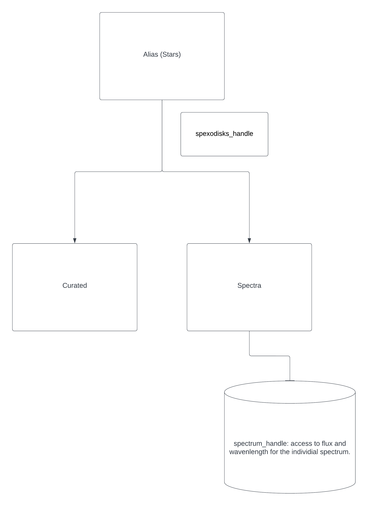

DataFlow
========

Before we begin with our API package, it's important to understand the data flow of the application.

The database is seperated by the following labels:

.. table:: Spectra
   :widths: auto

   ======================   ======================
     spectrum_handle        spectrum_display_name
   ======================   ======================
   False                    True
   ======================   ======================

The following diagram shows the data flow of the application:

